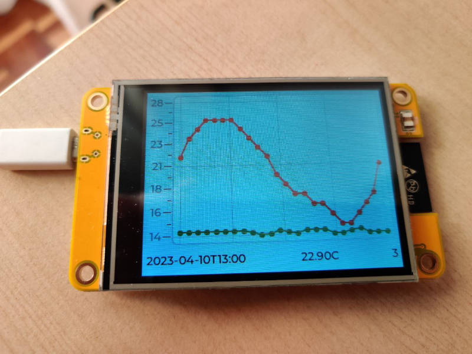

# Display meteorological information using an ESP32-2432S028 board

## Result

  

## Installation

I am using Arduino IDE v2.0.4 on Ubuntu. If you are using a different system, you'll have to adapt these instructions to your particular setting. In what follows, will assume that Arduino sketches are stored in `~/Arduino/` and Arduino installed libraries at `~/Arduino/libraries`.

- **General board installation** · You can follow [these instructions](https://randomnerdtutorials.com/installing-the-esp32-board-in-arduino-ide-windows-instructions/).
- **Required libraries** · Use the Arduino IDE to install the `ArduinoJson`, `LovyanGFX`, and `lvgl` libraries.
- **Code** · Create a folder in `~/Arduino/` and copy all the files in the `src` folder of this repo there ---or, alternatively, use links---.
- **Project configuration**:

    - `lv_conf.h` - Copy (or make a link to) this file to `~/Arduino/libraries`. Therefore, it will be contained in the same folder as the `lvgl` library, this is, both `lv_conf.h` and the `lvgl` folder have to be contained in the same folder.
    - `config_example.h` - Make a copy of it, call it `config.h` and edit the contents to suit your own configuration. In particular, you'll have to:

        - Provide your particular WiFi details.
        - Edit the URL's: the sample ones query Madrid's data.

- **Compiling, etc** · Connect your ESP32-ESP32-2432S028 with your computer via USB, complile, run, enjoy.

## Notes

- This is an early version of my application. Changes may happen in the near future.
- Feel free to experiment with other series provided by the weather API. I chose temperature and WMO climate code, but there are many other options.
- If you need to process JSON files other than mine, you'll surely profit from using the [ArduinoJson Assistant](https://arduinojson.org/v6/assistant/#/step1).
- Most of the configuration files and a large part of the scaffolding in the main file come from a Github repo that I have been able to find again. Many thanks have to be given to this unknown original author.

